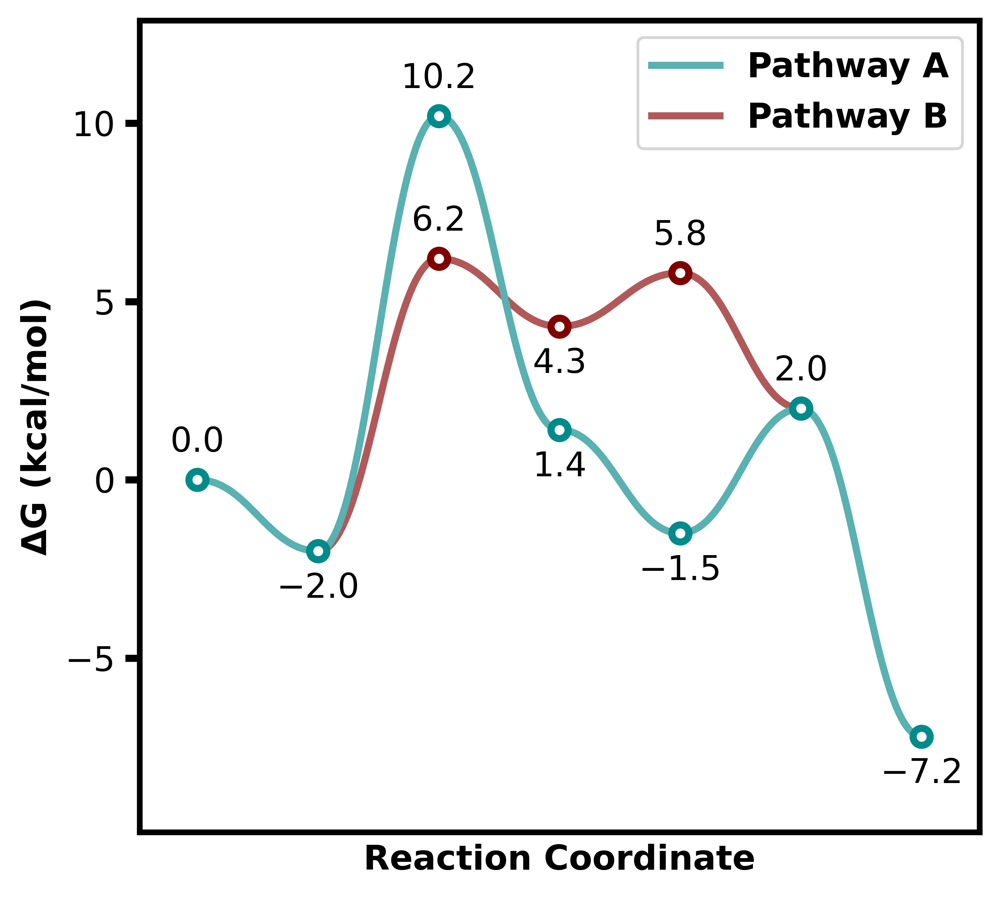
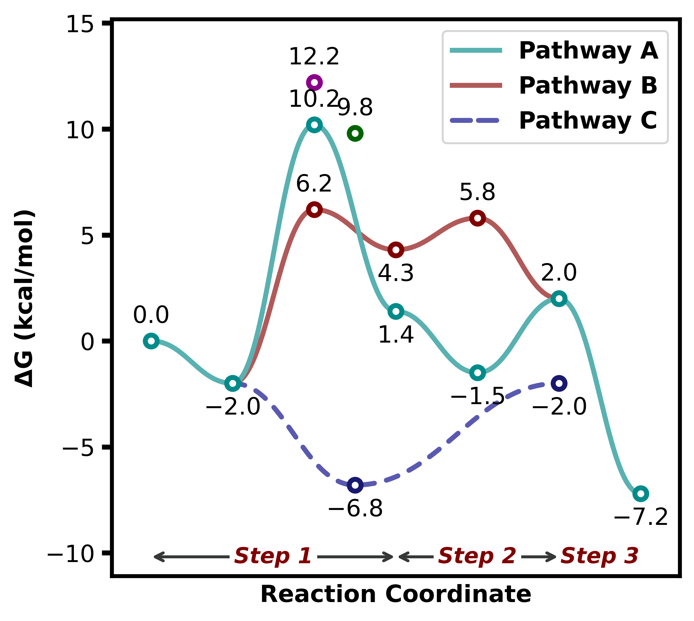
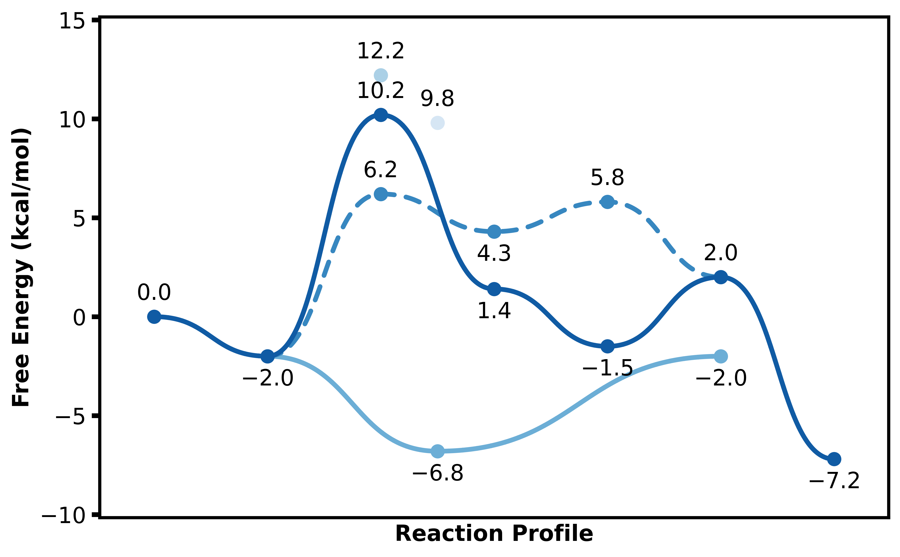
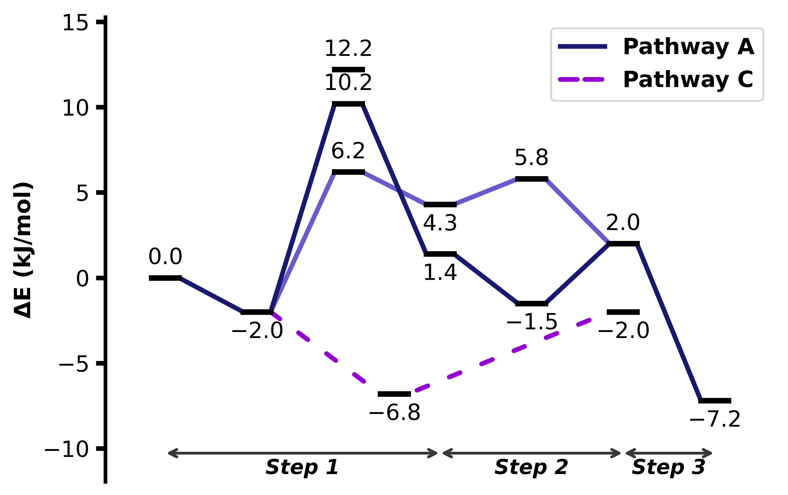
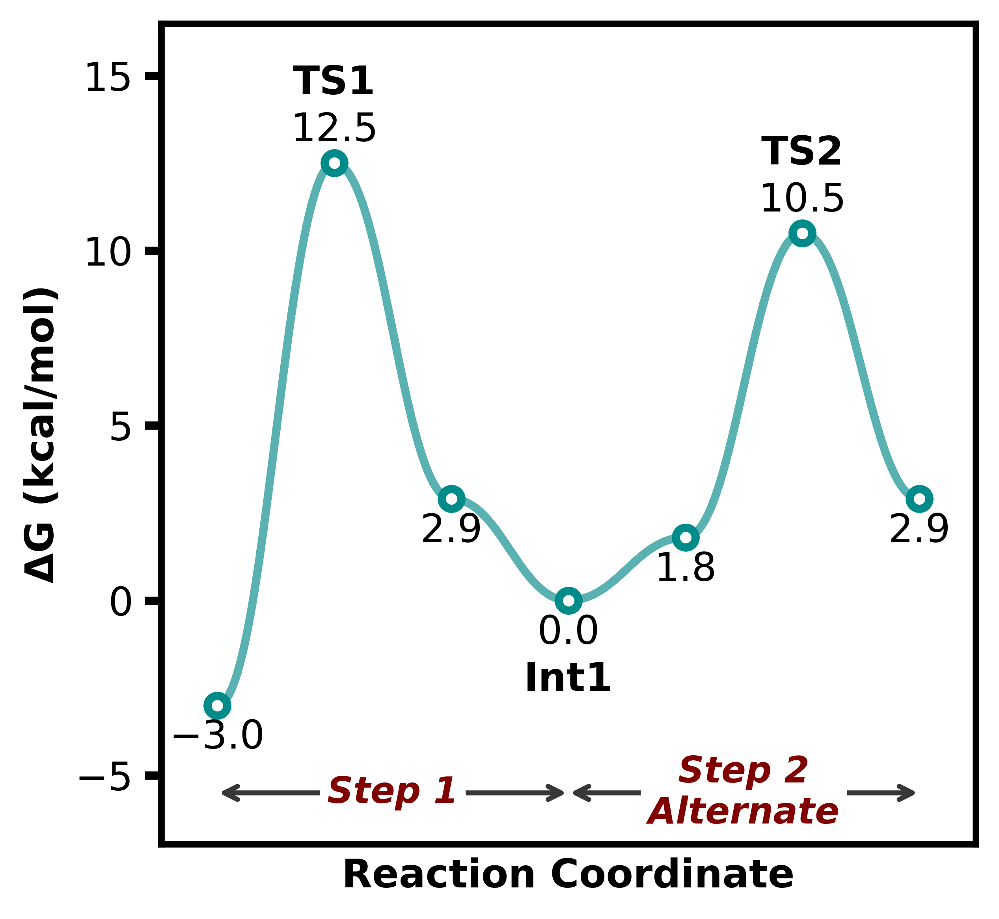
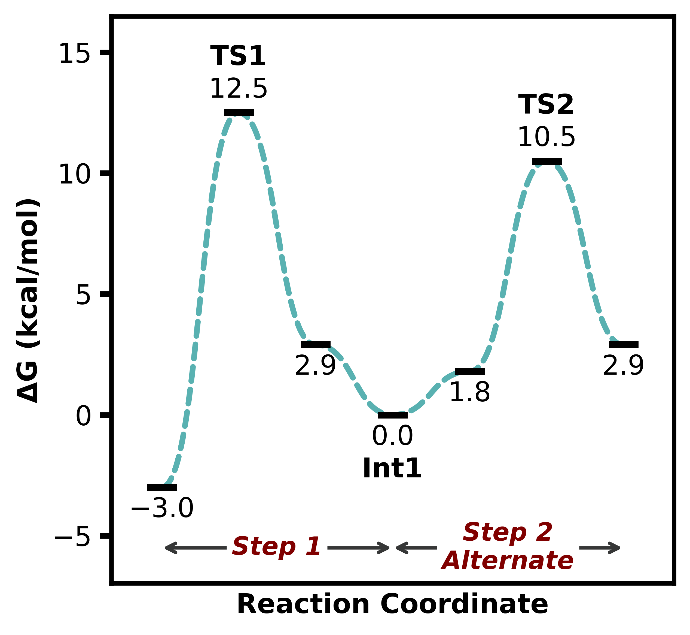
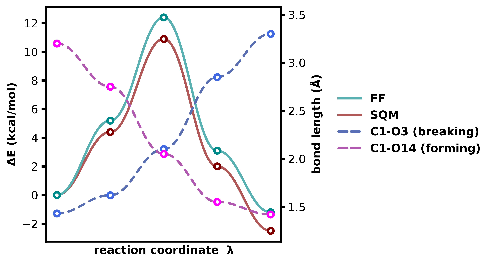
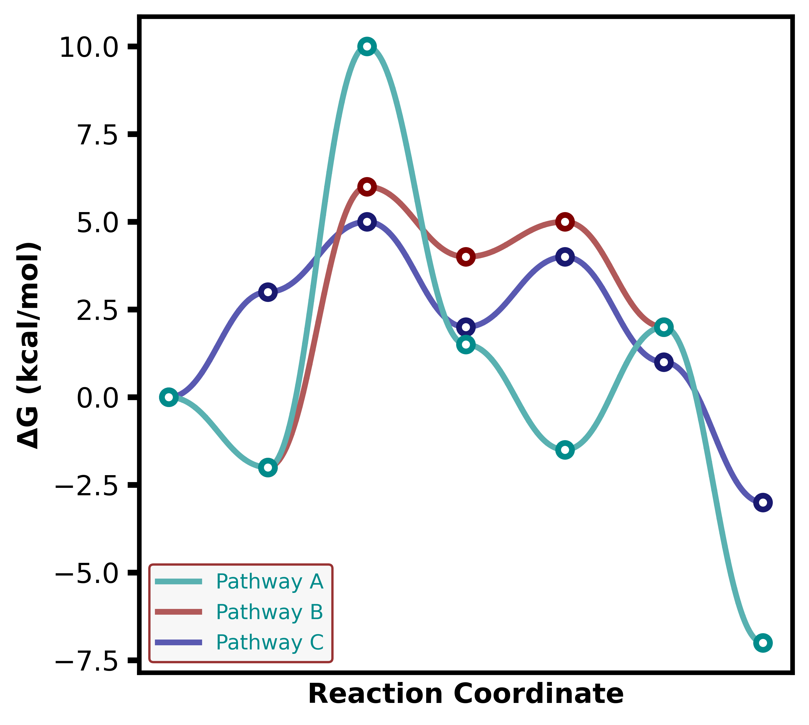

# plotprofile 
Código en Python para trazar rápidamente perfiles de reacción con aspecto profesional, con varias opciones de personalización disponibles.

Más información disponible en [ReadTheDocs](https://plotprofile.readthedocs.io/)

[](https://pepy.tech/projects/plotprofile)
[](https://github.com/aligfellow/plotprofile/actions)
[](https://github.com/aligfellow/plotprofile/blob/main/LICENSE)
[](https://docs.astral.sh/uv)
[](https://github.com/astral-sh/ruff)
[](https://github.com/astral-sh/ty)

## Instalación
### Google Colab
Se puede usar con `colab.ipynb` sin necesidad de una instalación local.

[](https://colab.research.google.com/github/aligfellow/plotprofile/blob/main/examples/colab.ipynb)

### Pip
Instalación más sencilla:
```bash
pip install plotprofile
```
o desde la versión más reciente:
```bash
pip install git+https://github.com/aligfellow/plotprofile.git
```
### Instalación local
```bash
git clone git@github.com:aligfellow/plotprofile.git
cd plotprofile
pip install .
```

## Uso mínimo en Python 
```python
from plotprofile import ReactionProfilePlotter

energy_sets = {
    "Pathway A": [0.00, -2.0, 10.2, 1.4, -1.5, 2.0, -7.2],
    "Pathway B": [None, -2.0, 6.2, 4.3, 5.8, 2.0],
}

plotter = ReactionProfilePlotter()
plotter.plot(energy_sets, filename="images/profile0")
```


## Más ejemplos en Python
### Ejemplo 1
```python
from plotprofile import ReactionProfilePlotter

energy_sets = {
    "Pathway A": [0.00, -2.0, 10.2, 1.4, -1.5, 2.0, -7.2],
    "Pathway B": [None, -2.0, 6.2, 4.3, 5.8, 2.0],
    "Pathway C": [None, -2.0, -6.8,-6.8, None, -2.0],
    "diastereomer": [None, None, 12.2],
    "diastereomer2": [None, None, 9.8, 9.8]
}
annotations = {
    'Step 1': (0,3),
    'Step 2': (3,5),
    'Step 3': (5,6),
}

plotter = ReactionProfilePlotter(linestyle={"Pathway C": "--"})
plotter.plot(energy_sets, annotations=annotations, filename="images/profile1")
```
Pasando `annotations` para etiquetar el perfil de reacción:
- esto se hace en la función de trazado y no en la clase
- utilizando un diccionario con claves de etiquetas y una tupla con los índices inicial y final en x
- permitiendo múltiples trazados con el mismo estilo pero con diferentes anotaciones



### Ejemplo 2 
Se pueden ajustar una variedad de otros parámetros para el trazado, incluyendo:
- `axes="box|y|x|both|None"` 
- `curviness=0.42` - redúcendolo para menos curvatura y viceversa
- `colors=["list","of","colors"]|cmap` - especificar lista de colores o mapa de colores
    - si la lista de colores es demasiado corta, los colores se repetirán. 
    - si el mapa de colores es inválido, se usará `viridis` como predeterminado
- `linestyle` - un estilo de línea de matplotlib para cada serie, o un diccionario de ellos con claves por etiqueta de serie. `'--'` y `solid` usan el guion propio del paquete (escala a la línea, espaciado por `dash_spacing`); `'-.'`, `':'` y tuplas `(offset, (on, off))` se pasan directamente a matplotlib
- `show_legend=Bool`
- `legend={...}` - se pasa directamente a `ax.legend()` de matplotlib, por lo que `loc`, `frameon`, `fontsize`, `ncols`, `title`, `framealpha`, etc. funcionan
- `units="kj|kcal"`
- `energy="e|electronic|g|gibbs|h|enthalpy|s|entropy|"`
- `x_label` y `y_label` se pueden usar para establecer etiquetas personalizadas de ejes, **sustituyendo** a `units` o `energy`

Usando `style="presentation"`, que establece un `figsize=(X,X)` más grande con líneas más gruesas y un tamaño de fuente mayor:
```python
plotter = ReactionProfilePlotter(style="presentation", linestyle={"Pathway B": "--"}, point_type='dot', desaturate=False, colors='Blues_r', show_legend=False, curviness=0.5, x_label='Reaction Profile', y_label='Free Energy (kcal/mol)')
plotter.plot(energy_sets, filename="images/profile2")
```



### Ejemplo 3 
- Líneas rectas definidas en un estilo, lo que también se puede hacer pasando `curviness=0`
- Las etiquetas se pueden colocar debajo de la flecha de anotación 
- Algunos parámetros relacionados con los datos de trazado se pueden ajustar en `ReactionProfilePlotter.plot`:
    - `include_keys` - solo se incluyen algunas de las claves `keys()` de `energy_sets` en el trazado
    - `exclude_from_legend` - excluye una de las claves de `energy_sets` de la leyenda

```python
plotter = ReactionProfilePlotter(style="straight", figsize=(6,4), linestyle={"Pathway C": "--"}, point_type='bar', annotation_color='black', axes='y', colors=['midnightblue', 'slateblue', 'darkviolet'], energy='electronic', units='kj', annotation_below_arrow=True, dash_spacing=5.0, desaturate=False)
plotter.plot(energy_sets, annotations=annotations, filename="images/profile3", exclude_from_legend=["Pathway B"], include_keys=["Pathway A", "Pathway B", "Pathway C", "diastereomer"])
```



### Ejemplo 4 
- Las etiquetas de puntos también se pueden agregar pasando `point_labels` a `ReactionProfilePlotter.plot`
- Las anotaciones pueden incluir caracteres de nueva línea `\n` y el espaciado se ajustará automáticamente

```python
from plotprofile import ReactionProfilePlotter

energy_sets = {
    "1": [-3.0, 12.5, 2.9, 0.0, 1.8, 10.5, 2.9]
}

annotations = {
    'Step 1': (0,3),
    'Step 2\nAlternate': (3,6),
}

point_labels = {
    "1": [None, "TS1", None, "Int1", None, "TS2"]
}

plotter = ReactionProfilePlotter(figsize=(4.5,4), axes='box', show_legend=False)
plotter.plot(energy_sets, annotations=annotations, point_labels=point_labels, filename="images/profile4")
```



### Ejemplo 5 
- Se pueden ajustar las longitudes y anchos de las barras
- El comportamiento predeterminado de la línea/curva con barras es conectar en los bordes, esto se puede desactivar con `connect_bar_ends=False`
- El espaciado de los guiones de la línea se puede cambiar con `dash_spacing` 


```python
from plotprofile import ReactionProfilePlotter

energy_sets = {
    "1": [-3.0, 12.5, 2.9, 0.0, 1.8, 10.5, 2.9]
}

annotations = {
    'Step 1': (0,3),
    'Step 2\nAlternate': (3,6),
}

point_labels = {
    "1": [None, "TS1", None, "Int1", None, "TS2"]
}

plotter = ReactionProfilePlotter(figsize=(4.5,4), axes='box', curviness=0.5, show_legend=False, point_type='bar', bar_length=0.3, bar_width=3, connect_bar_ends=False, linestyle={"1": "--"}, dash_spacing=1.5)
plotter.plot(energy_sets, annotations=annotations, point_labels=point_labels, filename="images/profile5")
```



### Ejemplo 6
`secondary={label: [values]}` en `plot()` agrega un eje derecho, para cantidades que comparten la coordenada de reacción pero no las unidades. Mismos índices x, misma leyenda.

Las claves de estilo establecen ambos ejes. `y1` y `y2` aceptan las mismas claves y anulan solo un eje; `y2` tiene como predeterminado su propia paleta y `linestyle='--'`.

```python
plotter = ReactionProfilePlotter(figsize=(7.6,4), curviness=0.0, labels=False, energy='E', square=True,
                                 x_label='reaction coordinate  λ',
                                 legend={'outside': True, 'anchor': 1.22},
                                 y2={'label': 'bond length (Å)', 'colors': 'plasma'})
plotter.plot({"force field": [0.0, 5.2, 12.4, 3.1, -1.2], "g-xTB": [0.0, 4.4, 10.9, 2.0, -2.5]},
             secondary={"C1-O3 (breaking)": [1.43, 1.62, 2.10, 2.85, 3.30],
                        "C1-O14 (forming)": [3.20, 2.75, 2.05, 1.55, 1.42]},
             filename="images/profile24")
```


`y2` acepta `colors`, `curviness`, `linestyle`, `line_width`, `marker_size`, `point_type`, `bar_length`, `bar_width`, `connect_bar_ends`, `desaturate`, `desaturate_factor` y `dash_spacing`:
```python
ReactionProfilePlotter(curviness=0.0, point_type='bar',                                    # ambos ejes
                       y2={'point_type': 'dot', 'curviness': 0.42, 'linestyle': 'solid'})  # solo eje derecho
```

### Ejemplo 7
`legend` se pasa a `ax.legend()` de matplotlib, por lo que `frameon`, `edgecolor`, `facecolor`, `framealpha`, `labelcolor`, `ncols`, `title`, `bbox_to_anchor`, etc. funcionan. Además, dos extras: `outside=True` coloca la leyenda al lado de los ejes (`anchor` establece la distancia), y `frameon` predeterminado está activado dentro y desactivado fuera.

La fuente del trazado es negrita por defecto, y la leyenda la hereda. Usa `prop` de matplotlib para quitar la negrita solo a la leyenda:

```python
plotter = ReactionProfilePlotter(labels=False, legend={
    'loc': 'lower left',
    'frameon': True, 'edgecolor': 'maroon', 'facecolor': 'whitesmoke',  # borde
    'labelcolor': 'darkcyan',                                           # color del texto
    'prop': {'weight': 'normal'},                                       # no negrita
    'fontsize': 9,
})
plotter.plot(energy_sets, filename="images/profile25")
```


Ver [examples/example.ipynb](./examples/example.ipynb)

## Escaneos e IRCs
Por defecto, el eje x es el índice del punto, equidistante, que es lo que quiere un perfil esquemático. Para un escaneo o un IRC es una cantidad real, por lo que pase `x` a `plot()`:

```python
r = [1.5, 1.8, 2.1, 2.2, 2.4, 3.5, 4.5]          # pasos desiguales, densos cerca del TS
E = [0.0, 4.0, 9.0, 11.0, 12.6, 3.0, 1.0]

plotter = ReactionProfilePlotter(
    curviness=0.0,        # unir los puntos calculados directamente
    labels=False,
    point_type='dot',
    x_indices=True,       # mostrar las marcas x
    axes='both',
    x_label='r(C-Cl) / Å',
    energy='E',
)
plotter.plot({"scan": E}, x=r)
```

>[!NOTE]
>- `x` debe cubrir cada índice que usan las energías, y también se aplica a la serie secundaria.
>- Los espacios (`None`) y valores repetidos siguen funcionando: un repetido se coloca en el punto medio de los dos valores `x` que abarca.
>- `annotations` aún se dan en **índices**, no en valores `x`.
>- `bar_length` está en unidades del eje x, así que escálalo al rango de `x`.

## Guardado
Los trazados se pueden guardar pasando `filename` a `plotter.plot()`. El formato de salida está controlado por `file_format` y admite cualquier formato estándar de matplotlib (p. ej., `png`, `svg`, `pdf`, `eps`).

`svg`, `pdf` y `eps` son vectoriales: escalables, con el texto dejado como texto real, por lo que las etiquetas permanecen editables en Illustrator o Inkscape.

```python
plotter.plot(energy_sets, filename="my_profile", file_format="svg")
```

`dpi` (predeterminado 600) solo se aplica a formatos ráster como `png`; no tiene un efecto significativo en la salida vectorial.

```python
plotter.plot(energy_sets, filename="my_profile", file_format="png", dpi=300)
```

## Más detalles
>[!IMPORTANT]
>- Las curvas secundarias pueden comenzar después del 1er punto, solo necesitan tener una entrada `None` en la lista de energías *p. ej.* `[None, 0.0, 1.0]`
>- Los puntos individuales se pueden colocar si esta es una lista con solo un valor de energía (*p. ej.* TS diastereomérico sin desorden, por ejemplo, ver ejemplos)
>    - las etiquetas de estos no se agregan a la leyenda
>    - estos incluso se pueden colocar como puntos individuales entre dos índices con `[None, 5.0, 5.0]`
>- El espaciado de los puntos en el perfil se puede alterar mediante:
>    - pasar la misma energía dos veces seguidas, lo que colocará el punto a mitad de camino entre los dos índices x, *es decir*, el punto de la Ruta C en los ejemplos, *p. ej.* `[0.0, 5.0, 5.0]`
>    - con una entrada como `[0.0, None, 1.0]` que tendrá una línea que conecta los índices 0 y 2 de esta lista con la alineación correcta del eje x
>- Los tipos de datos pueden ser:
>    - `dict`, con etiquetas para la leyenda
>    - lista de listas (sin etiquetado de diferentes perfiles)
>    - lista única

## CLI
La instalación proporciona el comando `plotprofile`. Los datos se ingresan como archivos JSON; el estilo se encuentra en un JSON de `--config` cuyas claves son exactamente los argumentos de `ReactionProfilePlotter`. Una clave desconocida es un error, no una advertencia.

```bash
plotprofile examples/input.json -o profile -f svg
plotprofile examples/input.json --config examples/config.json --annotations examples/annotations.json
plotprofile scan.json --secondary bonds.json --x coord.json --config scan.json -o irc -f svg
```

```
plotprofile INPUT [-o OUT] [-f {png,svg,pdf,eps}] [--dpi N]
                  [--config FILE] [--secondary FILE] [--x FILE]
                  [--annotations FILE] [--point-labels FILE]
```

Ver [examples/config.json](./examples/config.json) y la [documentación de CLI](https://plotprofile.readthedocs.io/en/latest/cli.html).

## Opciones de configuración
El comportamiento se puede personalizar mediante `styles.json` o pasando parámetros a `ReactionProfilePlotter()`.

El conjunto completo de opciones, y los ajustes predeterminados, `presentation` y `straight`, se encuentran en [`src/plotprofile/styles.json`](./src/plotprofile/styles.json) — también disponible en la [documentación de estilos](https://plotprofile.readthedocs.io/en/latest/json_styles.html).

## Desarrollo
Requiere [uv](https://docs.astral.sh/uv/) y [just](https://github.com/casey/just).

```bash
git clone https://github.com/aligfellow/plotprofile.git
cd plotprofile
just setup   # instalar dependencias de desarrollo y pre-commit
just check   # lint + verificación de tipos + pruebas
```

| Comando | Descripción |
|---|---|
| `just check` | Ejecutar lint + verificación de tipos + pruebas |
| `just lint` | Formatear y verificar lint con ruff |
| `just type` | Verificar tipos con ty |
| `just test` | Ejecutar pytest con cobertura |
| `just fix` | Corregir automáticamente problemas de lint |
| `just build` | Construir distribución |
| `just setup` | Instalar todas las dependencias de desarrollo |

GitHub Actions ejecuta las mismas verificaciones en cada push a `main` y en cada PR.

Generado desde [aligfellow/python-template](https://github.com/aligfellow/python-template); incorpora cambios posteriores de la plantilla con `copier update --trust`.
